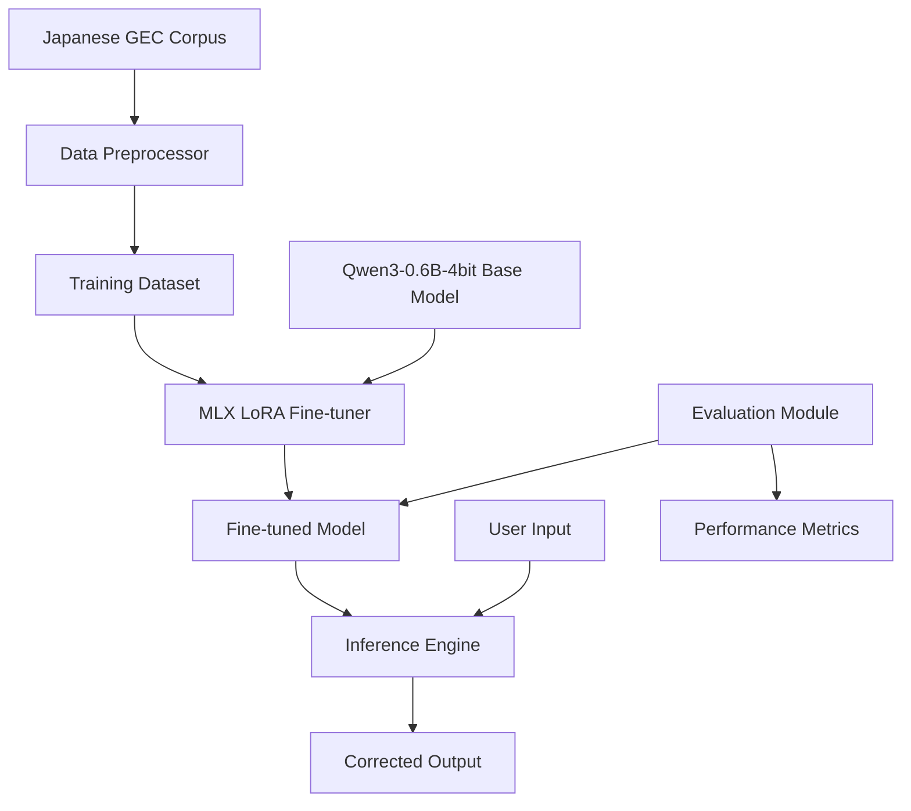

# Design Document

## Overview

The Japanese Grammar Correction system is designed as a machine learning pipeline that fine-tunes the Qwen3-0.6B-4bit model using MLX LoRA for Japanese grammatical error correction. The system consists of three main phases: data preprocessing, model fine-tuning, and inference serving.

The architecture leverages the existing Japanese GEC corpus data and MLX-LM framework to create a specialized model for Japanese grammar correction. The system will process the corpus data into a format suitable for MLX training, fine-tune the base model, and provide an interface for users to input Japanese text and receive corrected output.

## Architecture



The system follows a pipeline architecture with clear separation of concerns:

1. **Data Processing Layer**: Handles corpus parsing and dataset preparation
2. **Training Layer**: Manages the MLX LoRA fine-tuning process
3. **Inference Layer**: Provides the grammar correction service
4. **Evaluation Layer**: Assesses model performance

## Components and Interfaces

### Data Preprocessor

**Purpose**: Convert the Japanese GEC corpus into MLX-compatible training format

**Key Functions**:
- `parse_gec_corpus(corpus_path: str) -> List[Tuple[str, str]]`: Parse the tab-separated corpus file
- `extract_error_corrections(line: str) -> Tuple[str, str]`: Extract clean error/correct sentence pairs
- `format_for_training(pairs: List[Tuple[str, str]]) -> List[Dict[str, str]]`: Convert to MLX training format
- `split_dataset(data: List[Dict], train_ratio: float = 0.8) -> Tuple[List, List]`: Create train/validation splits

**Input Format**: Tab-separated corpus with error markers `<>` and correction markers `()`
**Output Format**: List of dictionaries with "text" field containing input-output pairs

### MLX LoRA Fine-tuner

**Purpose**: Fine-tune the Qwen3-0.6B-4bit model using the processed Japanese GEC data

**Key Functions**:
- `setup_lora_config() -> Dict`: Configure LoRA parameters for Japanese GEC
- `load_base_model(model_name: str) -> nn.Module`: Load the Qwen3-0.6B-4bit model
- `fine_tune_model(model, train_data, valid_data, config) -> nn.Module`: Execute LoRA fine-tuning
- `save_adapters(model, output_path: str)`: Save the fine-tuned LoRA adapters

**Configuration**:
- LoRA rank: 16 (balanced between performance and efficiency)
- Target modules: attention and feed-forward layers
- Learning rate: 1e-4 with cosine decay
- Batch size: 4 (memory-efficient for 4-bit model)

### Inference Engine

**Purpose**: Provide grammar correction service using the fine-tuned model

**Key Functions**:
- `load_fine_tuned_model(model_path: str, adapter_path: str) -> nn.Module`: Load model with adapters
- `correct_grammar(text: str) -> str`: Main correction function
- `preprocess_input(text: str) -> str`: Clean and prepare input text
- `postprocess_output(text: str) -> str`: Clean and format corrected output

**Interface**:
- Input: Raw Japanese text string
- Output: Grammatically corrected Japanese text string
- Error handling for empty input, non-Japanese text, and model failures

### Evaluation Module

**Purpose**: Assess the performance of the fine-tuned model

**Key Functions**:
- `evaluate_model(model, test_data) -> Dict[str, float]`: Calculate GEC metrics
- `calculate_precision_recall_f1(predictions, references) -> Dict`: Standard GEC metrics
- `generate_performance_report(metrics: Dict) -> str`: Create detailed evaluation report

**Metrics**:
- Sentence-level accuracy
- Token-level precision, recall, and F1
- BLEU score for fluency assessment

## Data Models

### GECPair
```python
@dataclass
class GECPair:
    error_text: str      # Original text with errors
    correct_text: str    # Corrected text
    error_spans: List[Tuple[int, int]]    # Error positions
    correction_spans: List[Tuple[int, int]]  # Correction positions
```

### TrainingConfig
```python
@dataclass
class TrainingConfig:
    model_name: str = "mlx-community/Qwen3-0.6B-4bit"
    lora_rank: int = 16
    lora_alpha: int = 32
    learning_rate: float = 1e-4
    batch_size: int = 4
    num_epochs: int = 3
    warmup_steps: int = 100
    save_steps: int = 500
```

### InferenceRequest
```python
@dataclass
class InferenceRequest:
    text: str
    max_length: int = 512
    temperature: float = 0.1
    top_p: float = 0.9
```

## Error Handling

### Data Processing Errors
- **Malformed corpus lines**: Skip and log problematic entries
- **Encoding issues**: Handle UTF-8 encoding problems gracefully
- **Empty datasets**: Validate minimum dataset size requirements

### Training Errors
- **Memory limitations**: Implement gradient checkpointing and batch size adjustment
- **Model loading failures**: Provide clear error messages and fallback options
- **Training divergence**: Implement early stopping and learning rate adjustment

### Inference Errors
- **Model not found**: Check for model files and provide setup instructions
- **Input validation**: Handle empty, too long, or invalid input gracefully
- **Generation failures**: Implement timeout and fallback mechanisms

## Testing Strategy

### Unit Tests
- Data preprocessing functions with sample corpus data
- Model configuration and parameter validation
- Input/output formatting and validation functions

### Integration Tests
- End-to-end training pipeline with small dataset
- Model loading and inference pipeline
- Error handling scenarios

### Performance Tests
- Training time and memory usage benchmarks
- Inference latency and throughput measurements
- Model quality evaluation on held-out test set

### Test Data
- Use 10% of corpus data as held-out test set
- Create synthetic test cases for edge cases
- Validate against known good/bad Japanese grammar examples

The testing approach ensures reliability across all components while maintaining focus on the core grammar correction functionality.